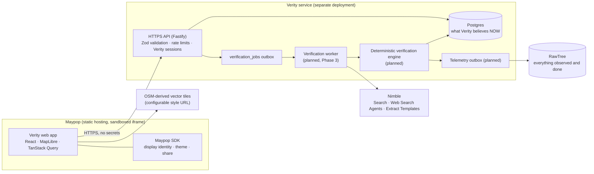
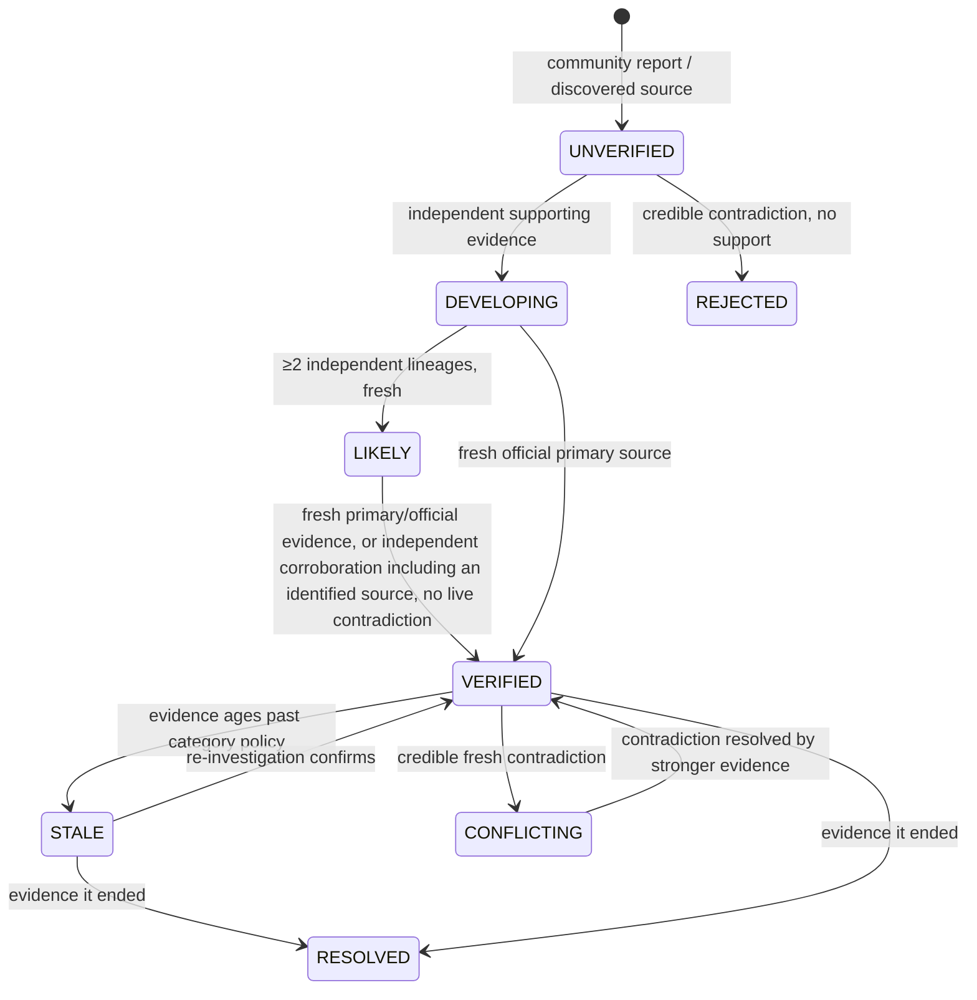

# Verity architecture

Verity answers one question: *what is actually happening around me right now,
and can I trust it?* It keeps an evolving, evidence-backed record of each
real-world event. The key rule is **do not show certainty the evidence doesn't
justify**.

> **Status:** Phase 1 (the frontend) and Phase 2 (the Verity service: Postgres,
> authentication, reports, signals, follows, transitions, outbox) are
> implemented. Phase 3 (evidence verification with Nimble) is in progress: the
> worker, lite Search, deterministic Extract enrichment and Agent escalation
> are implemented and tested, but not yet deployed or run against production.
> Sections marked
> **(planned)** are later phases; their designs and API facts come from the
> official Nimble and RawTree docs, which must be re-checked before
> implementation (the Nimble agent API has changed since this was written).

## 1. System overview



**The trust boundary.** The browser and Maypop are untrusted. Every credential
(Nimble, RawTree, database, session signing) and every security-sensitive
decision (validation, authorization, rate limits, state transitions) lives in
the Verity service. The frontend bundle contains only public configuration,
and two build-time guards enforce that (see [SECURITY.md](SECURITY.md)).

## 2. Repository layout

```
packages/contracts/   Shared API contract: Zod schemas, enums, limits, URL screening,
                      similarity helpers and demo fixtures. Used by frontend AND service.
apps/web/             The Maypop app (static Vite build).
  src/api/            VerityApi interface · HTTP client · demo adapter · unconfigured stub
  src/maypop/         SDK wrapper: connect-with-timeout, display identity, share, deep links
  src/features/       map/ events/ report/ following/ settings/ onboarding/
  src/lib/            status/category display, freshness text, time, geo, storage
  build/              Vite plugins: public-env guard, CSP <meta>
  scripts/            post-build bundle secret scan
  e2e/                Playwright smoke tests against the production bundle
apps/api/             The Verity service (Fastify 5, Drizzle ORM, Postgres / PGlite, Better Auth).
  drizzle/            SQL migrations: schema, integrity triggers, client-API lockdown
  src/config.ts       Validated environment; refuses insecure production settings
  src/db/             schema, client (postgres.js or PGlite), dev seed
  src/auth/           Better Auth setup, identity resolution, mailers
  src/domain/         read model, reports, dedupe, signals, state machine, transitions, outbox
  src/routes/         public reads · auth · contributions · internal (operator) routes
  src/verification/   verification core (Phase 3, pure): evidence, URLs, lineage, policy, rules, explanations, geocoding
  src/worker/         verification worker process (Phase 3): claim/lease, runs, apply, sweep, ports
  src/providers/      provider adapters behind the ports: nimble/ (Search: client, queries, normalizer, retriever), nominatim.ts (off by default)
  src/security/       CORS + origin guard, rate limiter, error handling
  test/               API tests against an in-memory Postgres
docs/MAYPOP.md        What Maypop provides, and the identity decision
maypop.toml           Maypop manifest (builds apps/web only)
```

## 3. Frontend (implemented)

### API abstraction

UI components talk only to the `VerityApi` interface (`src/api/types.ts`).
There are three implementations:

| Adapter | When | Behavior |
| --- | --- | --- |
| `createHttpApi` | `VITE_VERITY_API_URL` set | Talks to `/api/v1`, with `credentials: "omit"` and a 12 s timeout. **Every response is validated against the shared Zod contract** (malformed means error, never rendered). Writes carry the Verity bearer token. Without a session they return `auth_required` with no request, and the UI opens "Sign in to contribute", then retries the same action. Failures read "Verity is temporarily unavailable." |
| `createMockApi` | development, or `VITE_VERITY_DATA_SOURCE=mock` | Realistic San Francisco demo events covering every status. Same validation as the service. Optional simulated writes, labeled "demo only". A simulated report stays UNVERIFIED and ends "verification unavailable": demo mode never fabricates verification. |
| `createUnconfiguredApi` | production build without a service URL | An honest "not connected" state. **Never** falls back to demo data. |

Switching from demo to the real service is a configuration change only.

### Event contract

`packages/contracts/src/event.ts` defines `EventSummary` (lists, cards) and
`EventDetail` (summary plus claims, evidence, timeline and community
aggregates):

```
id, title, summary, category, coordinates{latitude, longitude},
approximate_location, affected_area, status, verification_state, origin,
source_count, independent_source_count,
community_confirmation_count, community_dispute_count,
first_seen_at, last_updated_at, last_verified_at, last_checked_at,
scheduled_start_at, scheduled_end_at, expires_at, is_demo
```

- **Statuses:** `UNVERIFIED, DEVELOPING, LIKELY, VERIFIED, CONFLICTING, STALE, RESOLVED, REJECTED`.
- **`verification_state`:** `queued | in_progress | idle | unavailable`. It is
  kept separate from status so "verification in progress" and "verification
  temporarily unavailable" are always visible.
- **Last checked vs. last verified:** `last_checked_at` is when Verity last
  re-checked sources, even if nothing changed. `last_verified_at` is when
  evidence last supported the status. Cards show *last checked*, never just
  *posted*.

**Evidence** records separate `quote` (verbatim source text) from `agent_note`
(Verity's research agent in its own words). The UI labels the latter "not a
quote". Each record also carries `lineage_id`, `counts_as_independent`,
`is_primary`, `source_class`, `freshness_state`, `location_match`,
`time_match`, `published_at_precision` (`instant` or `day`) and `found_via`
(`community_report`, `web_search`, `extended_verification`: provider-neutral,
and never a trust signal). No provider identifiers, model text, page bodies or
pipeline metadata are exposed.

**Event detail** is four separate parts: the status, "Why Verity says this"
(the deterministic engine's explanation), "Sources" and "Community input".
Sources are grouped by underlying report: one entry per independent source,
with "Also reported by N other pages using the same underlying report" and
"Repeats reporting from X" for the copies, so many pages never look like many
confirmations. Labels are plain language ("Official source", "Primary source",
"Published 18 min ago", "Published Oct 4 (date only)", "Out of date"). Sources
first found during the Agent investigation say only "Source discovered during
extended verification".

### Presentation of trust

- Cards read like `Verified · 3 independent sources · checked 4 min ago`. When
  copies exist, the count reads `2 independent sources (5 total)`.
- There are no percentages or probabilities anywhere. A test enforces that
  status copy never uses "%", "probability" or "confidence", and never claims
  truth or proof.
- Map markers use four meaningful colors (red: confirmed disruption, orange:
  developing, purple: planned, gray: stale or ended). Unverified reports get a
  **hollow dashed ring**, so uncertainty isn't conveyed by color alone. Every
  marker has a category icon, and every status badge has an icon plus text.
- Community signals appear only as counts, for example "3 people confirmed this
  is still happening in the last hour". No identities, distances or locations
  are shown.

### Map (MapLibre GL JS 6)

- **Basemap:** OpenFreeMap styles (OpenStreetMap-derived, no API key) by
  default. Swap providers with `VITE_MAP_STYLE_URL_LIGHT/DARK`; the CSP picks up
  the new origin. OSM attribution is always added. MapLibre fetches only the
  tiles the viewport needs, with no prefetching.
- **Clustering:** a GeoJSON source with `cluster: true`. Clusters remember
  whether they contain a confirmed urgent disruption (red ring).
- **Generated icons:** marker and cluster images are drawn on demand with
  Canvas 2D via `setMissingStyleImageResolver`, so the map doesn't depend on
  the tile provider's sprites or fonts.
- **Viewport loading:** `moveend` is debounced, and the bbox is clamped and
  rounded (`[w, s, e, n]`, at most 8° per axis). Beyond that the UI asks the
  user to zoom in.
- **Selection:** marker → preview card → detail. A list hover or the routed
  event shows a halo layer.
- **"Near me":** one low-accuracy `getCurrentPosition` call, made only on tap,
  rounded to about 110 m, kept in memory, and never stored or sent.
- **Graceful failure:** if WebGL is missing or the style fails, a "Map
  unavailable" panel appears and the list falls back to a default-area bbox.
  This is covered by tests.
- **Worker:** MapLibre 6 derives its worker URL from `import.meta.url`, so the
  worker is bundled by Vite and registered with `setWorkerUrl` (same origin,
  CSP `worker-src 'self'`).

### Layout and routes (hash router, for Maypop deep links)

`#/welcome` · `#/map` · `#/events/:id` · `#/report` · `#/following` · `#/settings`

- **Desktop:** a 400 px sidebar with the feed or detail, and the map filling the rest.
- **Mobile:** map first, a three-stop bottom sheet whose handle is a real
  button with dragging as an enhancement, and a floating Report button.
- **Themes:** Light, Dark and System. System follows the Maypop host theme
  inside Maypop and the OS outside it. The choice is persisted per device.
  Reduced-motion preferences are respected.
- **Polling:** every 5 s while verification is running, 30 s while queued, otherwise every 60 s.
- **Sign-in:** a dialog that appears only when someone tries to contribute
  (email, then a 6-digit code). After sign-in the attempted action resumes
  (`useGuardedWrite`). Settings shows the Verity account and the Maypop profile
  as two separate things.

## 4. Verity service (implemented, Phase 2)

### Request path

`onRequest` origin guard → CORS → route → Zod validation (shared contract,
strict objects) → session check (protected routes) → Postgres-backed rate
limits → domain service (one transaction) → JSON. Errors leave through a
single handler as `{ error: { code, message, request_id } }`.

### Reports are not events

A **report** is one person's claim. An **event** is Verity's canonical belief
that something is happening. `createReport` (`src/domain/reports.ts`) runs in
**one transaction**:

1. **Serialize nearby reports.** It takes an advisory lock on (category kind,
   ~1 km cell), so simultaneous duplicate reports attach to one event instead
   of racing.
2. **Look for a duplicate** (`findDuplicateEvent`):
   - an active, non-demo event within 300 m, updated in the last 12 h;
   - with a compatible category and similar wording.
   - If the best match isn't clearly better than the runner-up, it counts as
     ambiguous and the report creates a new event.
3. **Attach or create.** A matching report attaches to that event; otherwise a
   new event is created as **UNVERIFIED**, with its creation audited in
   `event_state_transitions`.
4. **Store the report row.** The reporter comes from the session, never the
   body. A submitted `source_url` is validated and stored, **never fetched**.
5. **Add community evidence.** It writes a `source_records` row with the
   `community` lineage. Many reporters count as **one** independent source;
   a partial unique index enforces this.
6. **Add a timeline entry:** `report_received` or `report_merged`.
7. **Queue verification.** It writes a `verification_jobs` row (`VERIFY_EVENT`,
   `NEW_REPORT` or `REPORT_ATTACHED`) with an idempotency key, at most one open
   job per event.

No network call happens inside the transaction. In Phase 3 a worker will pick
up jobs after commit.

### Community signals

`POST /api/v1/events/:id/signals` with
`CONFIRM | DISPUTE | STILL_HAPPENING | NO_LONGER_HAPPENING | NOT_SURE`.

- **Two questions.** `validity` covers confirm/dispute; `current_state` covers
  still happening. A person has one *active* answer per question per event (a
  partial unique index).
- **Changing an answer** supersedes the old one, which stays in history.
- **Repeating an answer** is a no-op, so counts can't be inflated.
- **Counts are computed server-side** from active rows.
- **Signals never change status.** Disputes and "no longer happening" only
  queue re-verification.
- **Ended events** (RESOLVED, REJECTED) refuse new answers.
- **No location is stored with a signal.** "Nearby" isn't implemented until it
  has a privacy-preserving definition.

### State transitions

`transitionEvent` (`src/domain/transitions.ts`) is the only code that changes
`events.status`. In the caller's transaction it:

1. checks the edge against `ALLOWED_TRANSITIONS`;
2. checks the actor: community input can set nothing, `system` only
   STALE/RESOLVED, and `verifier`/`admin` anything allowed;
3. applies optimistic concurrency (expected current status);
4. writes the audit row and a `status_changed` timeline entry.

The database backs this up:

- A trigger rejects any status change made without the transaction-local flag
  the service sets.
- New events must start UNVERIFIED.
- `event_timeline` and `event_state_transitions` are append-only (UPDATE and
  DELETE raise errors).

Phase 2 produces UNVERIFIED events plus operator transitions through
`/internal/v1` (token-protected, refused to browsers).

### Data model (Postgres, `apps/api/src/db/schema.ts`)

| Table | Purpose | Key constraints |
| --- | --- | --- |
| `users` | Verity accounts (email only) | unique lowercase email |
| `auth_sessions`, `auth_verifications`, `auth_accounts` | Better Auth sessions, hashed one-time codes | sessions store no IP or user agent (enforced by hook) |
| `events` | Canonical events (the shared contract) | enum CHECKs (status, category, verification state, origin), coordinate ranges, lengths, schedule order, status trigger |
| `reports` | Individual claims | FK to event and reporter, ranges, `source_url ~ '^https?://'` |
| `community_signals` | Answers with history | type↔group consistency, `active = (superseded_at IS NULL)`, one active per (event, user, group) |
| `event_follows` | Follows | PK (user, event) |
| `source_records` | Evidence (community now, Nimble later). `source_url` holds the **canonical** URL | enum CHECKs, one independent record per (event, lineage), one record per (event, canonical URL) |
| `event_timeline` | User-facing history | append-only trigger |
| `event_state_transitions` | Audit of every status change | append-only, `from ≠ to`, reason required |
| `verification_jobs` | Outbox for verification work (reasons: new report, attached report, community dispute, manual, `RECHECK`) | unique idempotency key, one open job per event, attempt bounds |
| `verification_runs` | One logical run per job: provenance (counts, decision rule, transition, evidence ids) and retry safety for the single paid agent investigation | one per job; agent slot claimed before the call; ids, counts and short codes only |
| `geocode_cache` | Derived place names per provider and ~110 m cell (reverse geocoding for search context) | status ok/no_result only; lifetimes from policy; no user, reporter or event data |
| `rate_limit_counters` | Fixed-window limits | keys are HMACs (no raw email or IP) |

### API (`/api/v1`)

| Method & path | Auth | Notes |
| --- | --- | --- |
| `GET /events` | public | `bbox`, `statuses`, `categories`, `q`, `limit`, `cursor` (keyset), `updated_since`; REJECTED hidden by default |
| `GET /events/:id` | public | detail: evidence, timeline, claims, community counts |
| `GET /events/:id/evidence` · `/timeline` | public | |
| `POST /auth/email/start` | public | `{email}` → 202 (same answer whether or not an account exists) |
| `POST /auth/email/verify` | public | `{email, code}` → `{token, expires_at, user}` |
| `POST /auth/sign-out` | bearer | revokes the session |
| `GET /me` | bearer | masked email |
| `POST /reports` | bearer | shared report schema, 16 KB body limit |
| `POST /events/:id/signals` · `GET …/signals/mine` | bearer | |
| `POST/DELETE /events/:id/follow` · `GET /me/following` | bearer | |
| `GET /health` | public | |
| `/internal/v1/*` | internal token, no Origin header | transitions, jobs, audit (disabled unless `INTERNAL_API_TOKEN` is set) |

### Authentication model

| Concept | Source | Trusted for |
| --- | --- | --- |
| **MaypopProfile** (display name, avatar, app-scoped id) | Maypop SDK in the browser | Display only. Never sent to the service, never linked to an account. |
| **VerityIdentity** (internal user id) | Verified Verity session (bearer token) | Every write and every "my" read. |

Passwordless email codes come from **Better Auth**, a maintained TypeScript
auth library. Its email-OTP plugin stores codes hashed, with a 10-minute expiry
and 5 attempts per code; its bearer plugin issues **signed** tokens. Sessions
last 30 days, slide on use, and can be revoked.

Better Auth's own HTTP router is not exposed. Verity's routes call it
server-side and add validation and rate limits.

**Why bearer tokens instead of cookies:** see SECURITY.md under the cookie,
CORS and CSRF analysis.

## 5. Verification engine (Phase 3: pure core implemented; worker pending)

AI acquires and describes evidence. A **deterministic, unit-tested rules
engine** decides state transitions. The agent's recommendation is an input,
never the decision.



The pure core lives in `apps/api/src/verification/` (no database or network):
`evidence.ts` (the provider-neutral `NormalizedEvidence` contract and its
mapping to `source_records`), `url.ts` (conservative canonical URLs,
publisher identity via the Public Suffix List), `attribution.ts` and
`lineage.ts` (independence), `policy.ts` (the single, configurable freshness
and threshold policy, whose values are initial heuristics to calibrate),
`rules.ts` (the ordered rule table and `decide()`), `explain.ts` (fixed
explanation templates) and `geocoding.ts` (the reverse-geocoder interface and
derived search context).

Rules the engine enforces, each covered by a test:

- Community reports alone cannot produce VERIFIED: they form one lineage and
  never count as external support.
- **Product rule (S4.1): VERIFIED needs an identified source.** On top of every
  other requirement, at least one qualifying supporting record must come from
  an identified source class (`policy.rules.verifiedSourceClasses`, initially
  `OFFICIAL` and `FIRST_PARTY`; these come only from the reviewed registry or
  `.gov`, never from text or a provider's label). UNKNOWN web sources are still
  stored, explained, used for lineage, and count toward DEVELOPING and LIKELY,
  but any number of them alone stops at LIKELY (escalation
  `no_identified_source`). The identified record must itself qualify: a stale,
  off-location, earlier-incident or stance-less official page does not count.
  There is no numeric credibility score.
- No results, timeouts and provider outages are not evidence; they change only
  the explanation.
- Independence counts **lineages**, not URLs and not publishers. Records are
  related only by explainable links: the same canonical URL, the same origin
  metadata, syndication, explicit attribution ("according to …"), or
  near-duplicate text. **Publisher identity alone never relates two records**:
  two articles from one newspaper can be independent, while different
  publishers repeating one wire story are one lineage. Each grouping stores
  its reason.
- REJECTED requires a primary official contradiction and no qualifying support,
  and only applies to unconfirmed events.
- Recent official primary evidence can establish a claim strongly. A source
  class is one input, not a verdict: official pages can be outdated, and social
  posts can be the earliest primary report.
- Contradictions block premature VERIFIED.
- Freshness is **category-sensitive**: a crash goes stale in minutes, a planned
  closure lasts hours or days, and a concert has scheduled times.
- Evidence that an event ended moves it toward RESOLVED.
- Every transition goes through `transitionEvent`, which appends to `event_state_transitions` with reasons and
  evidence ids. History is never overwritten.

## 6. Nimble integration (planned, Phase 3)

From the official v2 docs (`https://docs.nimbleway.com`, OpenAPI at
`/api-reference/openapi.json`): base URL `https://sdk.nimbleway.com`, auth
`Authorization: Bearer <NIMBLE_API_KEY>`, default limit 83 QPS / 5,000 QPM.

| Need | Nimble API | How Verity uses it |
| --- | --- | --- |
| Straightforward lookup | `POST /v2/search` (**implemented in S4**: `search_depth: "standard"`, `plain_text`, `max_results` ≤ 10, `time_range` or `start_date`, `include_domains` for official sources) | Up to 3 deterministic queries per job. Live probes 2026-10-03 (the spec agrees): `content` is empty unless `full_content: true`, whatever the depth; general focus returns no publication date. `focus: "news"` (lite only) returned `additional_data.publish_date` on every result, **date-only** (`YYYY-MM-DD`). Prices: lite $1.10, standard $5.00 per 1K searches; `full_content` adds $1.00 per 1K URLs. The S5 search mode is not yet decided. |
| Page reading (**implemented in S5**) | `POST /v2/extract` (vx6, no rendering, html plus Readability main-content markdown) | Deterministic enrichment of selected Search results, and of Agent citations whose text doesn't establish a claim. Candidates are chosen deterministically: identified sources first, one page per lineage, at most 4 per job, stopping as soon as the decision is settled. Publication time comes from the page's own metadata, by precedence (JSON-LD `datePublished`, `article:published_time`, …), and conflicting fields withhold it. Search and Extract enrich ONE record. **User-submitted links are never read.** |
| Multi-step investigation (**implemented in S5**) | `POST /v2/agents/runs` (async, **unnamed**: Nimble creates a minimal agent per run), poll `GET /v2/agents/{agent_id}/runs/{run_id}`, then `GET …/result`; `DELETE /v2/agents/{agent_id}` afterwards | Only after Search, Extract and a deterministic decision that still asks for it, and never while extraction is blocked. `effort: low`, `use_case: "research"`, and an `output_schema` asking for per-source URL and dates. Only citations (URL plus verbatim excerpts) and raw date proposals leave the client. |
| Known high-value sites | `POST /v2/extract/templates/…` | Not used. Extract with deterministic metadata parsing covers it for now. |

**Grounding (S5).** Agent output alone is never authoritative.

- **Evidence comes only from citations.** No citation, no record. A citation
  without verbatim text creates no record unless its page is read.
- **Source class and "primary" come only from the registry.** Nimble's
  `source_category` and `primary` labels are ignored, so the Agent can't
  promote a site.
- **Stance and location are classified deterministically** on the excerpt.
- **Strict date policy.** A model-proposed publication or event time becomes
  `publishedAt` / `eventTimeAsReported` only when a cited excerpt explicitly
  states it. An instant needs a date, a time and a zone; a written date alone is
  day precision. The value is taken from the excerpt, never the model. A clock
  time without a date establishes nothing. An unsupported proposal may trigger
  one page read within the extraction ceiling, and the page then supplies only
  its own metadata or an explicit sentence.
- Nimble's confidence, reasoning and prose answer are discarded. The
  deterministic engine decides.

**Bounds.** These limits apply per investigation:

- Effort `low` by default ($0.025, 10–30 s per the docs); `medium` only for
  conflicts or disputes. The docs' default, `high`, costs $0.50 and takes 5–15 min.
- One agent run per trigger and a hard timeout.
- Exponential backoff, and a global daily cap on agent runs and searches.
- Deduplicated jobs with idempotency keys.
- No recursion: the worker never enqueues work for itself from agent output.
- Failure means "verification temporarily unavailable" and existing evidence is
  kept. Nothing is inferred.

**Differences from the spec:**

1. The spec's `InvestigationResult.claims[].published_at` isn't in Nimble's
   citation objects. Verity requests it through `output_schema` and treats it as
   "as reported".
2. Nimble's output schemas forbid `format`, `pattern`, `min*`/`max*` and a root
   `anyOf`, so validation lives in Verity's Zod schemas instead.
3. "Persistent/generated agents for a known site" maps to **Extract Templates**
   (site-specific structured extraction). "Agentic investigation" maps to
   **Web Search Agents**.

## 7. Postgres and RawTree

**Postgres ("what Verity believes now")** is implemented: see §4. All queries
go through Drizzle and are parameterized; the few raw SQL fragments are static
text. Phase 3 adds:

- worker leasing on `verification_jobs` (`SELECT … FOR UPDATE SKIP LOCKED`,
  `locked_by`, backoff via `available_at`);
- `nimble_usage` (daily cap), `nimble_templates`, `notifications`;
- a telemetry outbox.

**Observability now:** structured JSON logs with request ids on every line.
Authorization headers, tokens, codes and emails are redacted. No bodies, query
strings, raw IPs or coordinates are logged. Phase 3 can ship the same events to
RawTree without changing call sites.

**RawTree ("everything Verity observed and did", planned)** is the append-only
observability layer: `source_observation`, `nimble_result`,
`agent_investigation`, `verification_run`, `status_transition`,
`community_signal`, `source_failure`, `latency`, `error`,
`reverification_trigger`. Records are written to a Postgres outbox in the same
transaction as the state change and shipped asynchronously with retries. If
RawTree is down, canonical state and the UI are unaffected.

RawTree facts from the docs (`https://rawtree.com/docs`):

- Insert with `POST https://api.rawtree.com/v1/tables/{table}`; tables are
  created on first insert.
- Query with `POST /v1/query`, which accepts read-only ClickHouse SQL.
- Select the database with `?database=` or `x-rawtree-database` (`RAWTREE_DATABASE`).
- OpenTelemetry traces go through `@rawtree/otel` or `?transform=otlp-traces`.

**Differences from the spec:**

1. RawTree has **no server-side query parameters**; the docs say to "treat
   parameterization as application code". Verity will only run fixed query
   templates whose inputs are validated as UUIDs or allowlisted enums, never
   free text.
2. `@rawtree/sdk` (v0.2.1) is marked experimental, and its README and docs
   disagree on the `insert` signature. Verity will wrap it in a thin adapter
   tested against the installed types, with a plain-HTTP fallback.

## 8. Identity boundary

Maypop exposes only a pseudonymous, app-scoped identity with no verifiable
assertion (see [docs/MAYPOP.md](docs/MAYPOP.md)). So:

- Reads are public.
- Writes require a **Verity** session. The browser sends only the bearer token;
  the service derives the user from it.
- Request schemas are strict, so a body with `user_id`, `created_by`, `role`,
  `maypop_user_id` or counts is rejected. Maypop-style headers carry no
  meaning. Tests and the browser suite cover this.
