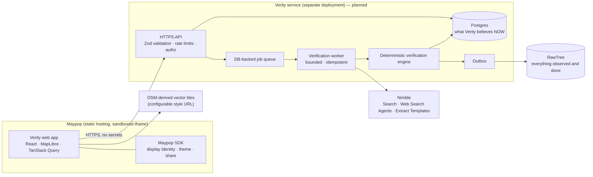
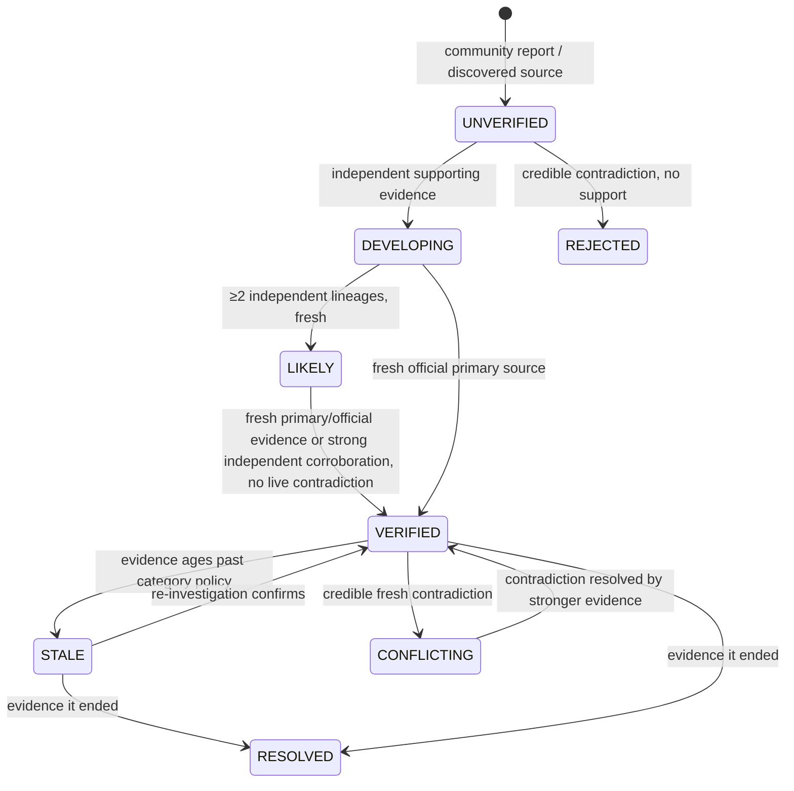

# Verity architecture

Verity answers one question: *what is actually happening around me right now,
and can I trust it?* It keeps an evolving, evidence-backed record of each
real-world event. The key rule is **do not show certainty the evidence doesn't
justify**.

> **Status:** Phase 1 (the frontend) is implemented. Sections marked
> **(planned)** describe the external Verity service built in later phases. The
> designs and API facts below come from the official Nimble and RawTree docs.

## 1. System overview



**The trust boundary.** The browser and Maypop are untrusted. Every credential
(Nimble, RawTree, database, session signing) and every security-sensitive
decision (validation, authorization, rate limits, state transitions) lives in
the Verity service. The frontend bundle contains only public configuration,
and two build-time guards enforce that (see [SECURITY.md](SECURITY.md)).

## 2. Repository layout

```
packages/contracts/   Shared API contract: Zod schemas, enums, limits, URL screening.
                      Imported by the frontend now and by the service later.
apps/web/             The Maypop app (static Vite build).
  src/api/            VerityApi interface · HTTP client · demo adapter · unconfigured stub
  src/maypop/         SDK wrapper: connect-with-timeout, display identity, share, deep links
  src/features/       map/ events/ report/ following/ settings/ onboarding/
  src/lib/            status/category display, freshness text, time, geo, storage
  build/              Vite plugins: public-env guard, CSP <meta>
  scripts/            post-build bundle secret scan
  e2e/                Playwright smoke tests against the production bundle
docs/MAYPOP.md        What Maypop provides, and the identity decision
maypop.toml           Maypop manifest (builds apps/web only)
```

## 3. Frontend (implemented)

### API abstraction

UI components talk only to the `VerityApi` interface (`src/api/types.ts`).
There are three implementations:

| Adapter | When | Behavior |
| --- | --- | --- |
| `createHttpApi` | `VITE_VERITY_API_URL` set | `fetch` with `credentials: "omit"`, 12 s timeout, **every response validated against the shared Zod contract** (malformed means error, never rendered), error bodies reduced to user-safe messages. Writes return `auth_unavailable` without a request (see §7). |
| `createMockApi` | development, or `VITE_VERITY_DATA_SOURCE=mock` | Realistic San Francisco demo events covering every status. Same validation as the service. Optional simulated writes, labeled "demo only". A simulated report stays UNVERIFIED and ends "verification unavailable": demo mode never fabricates verification. |
| `createUnconfiguredApi` | production build without a service URL | An honest "not connected" state. **Never** falls back to demo data. |

Switching from demo to the real service is a configuration change only.

### Event contract

`packages/contracts/src/event.ts` defines `EventSummary` (lists, cards) and
`EventDetail` (summary plus claims, evidence, timeline and community
aggregates):

```
id, title, summary, category, coordinates{latitude, longitude},
approximate_location, affected_area, status, verification_state, origin,
source_count, independent_source_count,
community_confirmation_count, community_dispute_count,
first_seen_at, last_updated_at, last_verified_at, last_checked_at,
scheduled_start_at, scheduled_end_at, expires_at, is_demo
```

- **Statuses:** `UNVERIFIED, DEVELOPING, LIKELY, VERIFIED, CONFLICTING, STALE, RESOLVED, REJECTED`.
- **`verification_state`:** `queued | in_progress | idle | unavailable`. It is
  kept separate from status so "verification in progress" and "verification
  temporarily unavailable" are always visible.
- **Last checked vs. last verified:** `last_checked_at` is when Verity last
  re-checked sources, even if nothing changed. `last_verified_at` is when
  evidence last supported the status. Cards show *last checked*, never just
  *posted*.

**Evidence** records separate `quote` (verbatim source text) from `agent_note`
(Verity's research agent in its own words). The UI labels the latter "not a
quote". Each record also carries `lineage_id`, `counts_as_independent`,
`is_primary`, `source_class`, `freshness_state`, `location_match` and
`time_match`.

### Presentation of trust

- Cards read like `Verified · 3 independent sources · checked 4 min ago`. When
  copies exist, the count reads `2 independent sources (5 total)`.
- There are no percentages or probabilities anywhere. A test enforces that
  status copy never uses "%", "probability" or "confidence", and never claims
  truth or proof.
- Map markers use four meaningful colors (red: confirmed disruption, orange:
  developing, purple: planned, gray: stale or ended). Unverified reports get a
  **hollow dashed ring**, so uncertainty isn't conveyed by color alone. Every
  marker has a category icon, and every status badge has an icon plus text.
- Community signals appear only as counts, for example "3 people confirmed this
  is still happening in the last hour". No identities, distances or locations
  are shown.

### Map (MapLibre GL JS 6)

- **Basemap:** OpenFreeMap styles (OpenStreetMap-derived, no API key) by
  default. Swap providers with `VITE_MAP_STYLE_URL_LIGHT/DARK`; the CSP picks up
  the new origin. OSM attribution is always added. MapLibre fetches only the
  tiles the viewport needs, with no prefetching.
- **Clustering:** a GeoJSON source with `cluster: true`. Clusters remember
  whether they contain a confirmed urgent disruption (red ring).
- **Generated icons:** marker and cluster images are drawn on demand with
  Canvas 2D via `setMissingStyleImageResolver`, so the map doesn't depend on
  the tile provider's sprites or fonts.
- **Viewport loading:** `moveend` is debounced, and the bbox is clamped and
  rounded (`[w, s, e, n]`, at most 8° per axis). Beyond that the UI asks the
  user to zoom in.
- **Selection:** marker → preview card → detail. A list hover or the routed
  event shows a halo layer.
- **"Near me":** one low-accuracy `getCurrentPosition` call, made only on tap,
  rounded to about 110 m, kept in memory, and never stored or sent.
- **Graceful failure:** if WebGL is missing or the style fails, a "Map
  unavailable" panel appears and the list falls back to a default-area bbox.
  This is covered by tests.
- **Worker:** MapLibre 6 derives its worker URL from `import.meta.url`, so the
  worker is bundled by Vite and registered with `setWorkerUrl` (same origin,
  CSP `worker-src 'self'`).

### Layout and routes (hash router, for Maypop deep links)

`#/welcome` · `#/map` · `#/events/:id` · `#/report` · `#/following` · `#/settings`

- **Desktop:** a 400 px sidebar with the feed or detail, and the map filling the rest.
- **Mobile:** map first, a three-stop bottom sheet whose handle is a real
  button with dragging as an enhancement, and a floating Report button.
- **Themes:** Light, Dark and System. System follows the Maypop host theme
  inside Maypop and the OS outside it. The choice is persisted per device.
  Reduced-motion preferences are respected.
- **Polling:** every 5 s while anything visible is being verified, otherwise every 60 s.

## 4. Verification engine (planned)

AI acquires and describes evidence. A **deterministic, unit-tested rules
engine** decides state transitions. The agent's recommendation is an input,
never the decision.



Rules the engine will enforce, each covered by a test:

- One anonymous community report cannot produce VERIFIED.
- Independence counts **lineages**, not URLs. Lineages are grouped by origin
  domain, near-duplicate excerpt text (shingle similarity) and explicit
  attribution ("according to …"). Ten syndicated copies of one press release
  count as one.
- Recent official primary evidence can establish a claim strongly. A source
  class is one input, not a verdict: official pages can be outdated, and social
  posts can be the earliest primary report.
- Contradictions block premature VERIFIED.
- Freshness is **category-sensitive**: a crash goes stale in minutes, a planned
  closure lasts hours or days, and a concert has scheduled times.
- Evidence that an event ended moves it toward RESOLVED.
- Every transition is appended to `status_transitions` with reasons and
  evidence ids. History is never overwritten.

## 5. Nimble integration (planned)

From the official v2 docs (`https://docs.nimbleway.com`, OpenAPI at
`/api-reference/openapi.json`): base URL `https://sdk.nimbleway.com`, auth
`Authorization: Bearer <NIMBLE_API_KEY>`, default limit 83 QPS / 5,000 QPM.

| Need | Nimble API | How Verity uses it |
| --- | --- | --- |
| Straightforward lookup | `POST /v2/search` (`query`, `max_results`, `time_range: hour/day/…`, `include_domains`, `focus: "news"`) | Fast discovery of candidate sources and known official domains. |
| Multi-step investigation | `POST /v2/agents/runs` (async), then poll `GET /v2/agents/{agent_id}/runs/{run_id}`, then `GET …/result` | A reusable agent via `agent_name` (memory persists), `use_case: "research"`, and an `output_schema` asking for per-source stance, location, published time and missing information. |
| Known high-value sites | `POST /v2/extract/templates/generations` (`url`, `prompt`, `output_schema`, `name`), then `POST /v2/extract/templates/run` | Structured extraction for transportation, transit and emergency pages. Template names are cached in Postgres and generated by an admin script, never per request. |
| User-submitted links | `POST /v2/extract` | Fetched **through Nimble**, after Verity's SSRF screen ([SECURITY.md](SECURITY.md)), never by the service directly. |

**Grounding.** Agent results include a trust report with per-claim citations,
**verbatim excerpts**, `source_category` (`official`, `news`, `social`,
`academic`, `aggregator`, `other`) and `primary`/`secondary`. Verity stores an
evidence record only if its URL appears among Nimble's citations, and it stores
the verbatim excerpt as `quote`. Nimble's `confidence` grade is recorded for
observability but never used as Verity's status.

**Bounds.** These limits apply per investigation:

- Effort `low` by default ($0.025, 10–30 s per the docs); `medium` only for
  conflicts or disputes. The docs' default, `high`, costs $0.50 and takes 5–15 min.
- One agent run per trigger and a hard timeout.
- Exponential backoff, and a global daily cap on agent runs and searches.
- Deduplicated jobs with idempotency keys.
- No recursion: the worker never enqueues work for itself from agent output.
- Failure means "verification temporarily unavailable" and existing evidence is
  kept. Nothing is inferred.

**Differences from the spec:**

1. The spec's `InvestigationResult.claims[].published_at` isn't in Nimble's
   citation objects. Verity requests it through `output_schema` and treats it as
   "as reported".
2. Nimble's output schemas forbid `format`, `pattern`, `min*`/`max*` and a root
   `anyOf`, so validation lives in Verity's Zod schemas instead.
3. "Persistent/generated agents for a known site" maps to **Extract Templates**
   (site-specific structured extraction). "Agentic investigation" maps to
   **Web Search Agents**.

## 6. Postgres and RawTree (planned)

**Postgres ("what Verity believes now")** holds the transactional, canonical
state:

- `users` and the auth tables
- `events`, `evidence` (append-only, lineage), `reports`
- `community_signals` (unique per user, event and kind)
- `status_transitions` (also the user-facing timeline)
- `verification_jobs` (`SELECT … FOR UPDATE SKIP LOCKED`, leases, attempts, idempotency keys)
- `follows`, `notifications`
- `rate_limits`, `nimble_usage` (daily cap), `nimble_templates`
- `telemetry_outbox`

All queries are parameterized through an ORM.

**RawTree ("everything Verity observed and did")** is the append-only
observability layer: `source_observation`, `nimble_result`,
`agent_investigation`, `verification_run`, `status_transition`,
`community_signal`, `source_failure`, `latency`, `error`,
`reverification_trigger`. Records are written to the Postgres outbox in the
same transaction as the state change and shipped asynchronously with retries.
If RawTree is down, canonical state and the UI are unaffected.

RawTree facts from the docs (`https://rawtree.com/docs`):

- Insert with `POST https://api.rawtree.com/v1/tables/{table}`; tables are
  created on first insert.
- Query with `POST /v1/query`, which accepts read-only ClickHouse SQL.
- Select the database with `?database=` or `x-rawtree-database` (`RAWTREE_DATABASE`).
- OpenTelemetry traces go through `@rawtree/otel` or `?transform=otlp-traces`.

**Differences from the spec:**

1. RawTree has **no server-side query parameters**; the docs say to "treat
   parameterization as application code". Verity will only run fixed query
   templates whose inputs are validated as UUIDs or allowlisted enums, never
   free text.
2. `@rawtree/sdk` (v0.2.1) is marked experimental, and its README and docs
   disagree on the `insert` signature. Verity will wrap it in a thin adapter
   tested against the installed types, with a plain-HTTP fallback.

## 7. Authentication boundary

Maypop exposes only a pseudonymous, app-scoped identity with no verifiable
assertion (see [docs/MAYPOP.md](docs/MAYPOP.md)). Until the Verity service has
its own verifiable authentication:

- Reads are public.
- Every write path is built and validated client-side, but the HTTP adapter
  refuses to send it (`auth_unavailable`), and the UI says nothing was recorded.
- No user id, role or Maypop identity is ever sent to the service as an
  authorization input.
